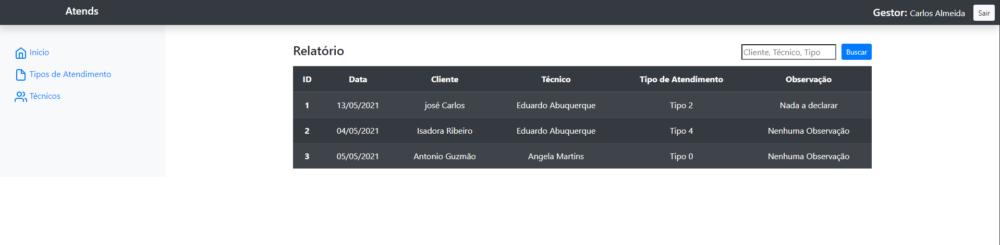
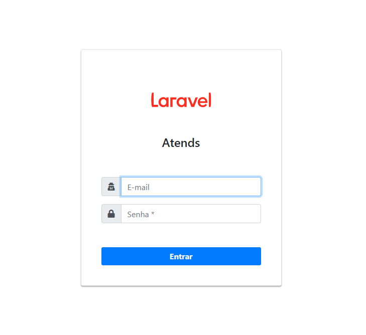
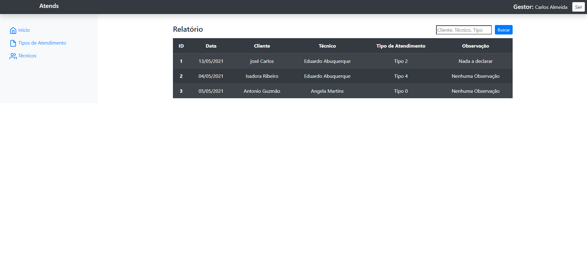
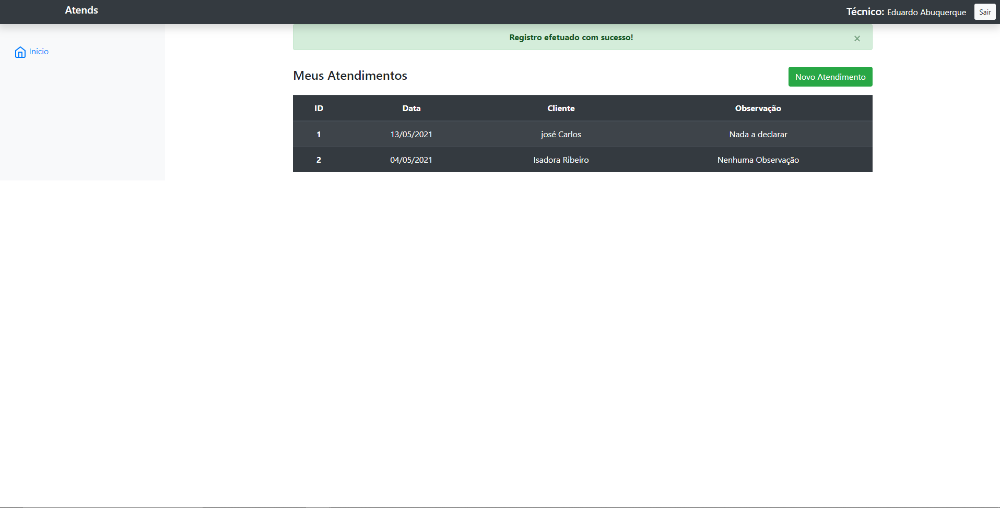

  

 

# Gestão de Atendimentos

 

## Descrição

Sistema simples para gerir e quantificar os atendimentos realizados por colaboradores de uma empresa. O mesmo conta com sistema de autenticação e áreas específicas para cada tipo de usuário (gestores e técnicos).

 

## Requisitos

- PHP na versão 7.3 ou superior.
- BCMath PHP Extensão ativa.
- Ctype PHP Extensão ativa.
- Fileinfo PHP Extensão ativa.
- JSON PHP Extensão ativa.
- Mbstring PHP Extensão ativa.
- OpenSSL PHP Extensão ativa.
- PDO PHP Extensão ativa.
- Tokenizer PHP Extensão ativa.
- XML PHP Extensão ativa.
- Composer.
- MySQL.
- GIT.
- Conexão com a internet.

---

## Instalação

- ### Windows

    1 - Faça download do <a href="https://www.apachefriends.org/pt_br/download.html">xampp</a> na versão 7.3 ou superior instale e inicie o servidor apache e o banco MySQL.

    2 - Faça download do executável do <a href="https://getcomposer.org/download/">composer</a> e instale

    3 - Faça download e instale o <a href="https://git-scm.com/download/win">GIT</a>.

    4 - Configure o GIT:

        $ git config --global user.name "NomeDeUsuario"
        $ git config --global user.email "email@exemplo.br"

 

---

- ### Linux

    Atualize a lista de pacotes.
        
        $ sudo apt update

    Instalação do Apache.
        
        $ sudo apt install apache2

    Instalação de Ferramentas necessárias posteriormente.
        
        $ sudo apt install curl git unzip

    Instalação das principais bibliotecas PHP utilizadas pelo Laravel.
        
        $ sudo apt install php7.4 libapache2-mod-php7.4 php7.4-mbstring php7.4-xmlrpc  php7.4-soap php7.4-gd php7.4-xml php7.4-cli php7.4-zip

    Instalação do MySql e do driver de acesso PHP.
        
        $ sudo apt install mysql-server-8.0 php-mysql php7.4-mysql mysql-client-core-8.0

    Configuração de senha do mysql.
        
        $ sudo mysql_secure_installation

    Execute o mysql-cli para criar um novo usuário (execute na ordem).
        
        $ sudo mysql
        $ CREATE USER user@'localhost' IDENTIFIED BY senha_com_no_minimo_8_digitos';
        $ GRANT ALL PRIVILEGES ON *. * TO user@'localhost';
        $ FLUSH PRIVILEGES;

    Instale o composer.

        $ sudo apt install composer

    Instalar pacote global de criação de projetos Laravel.

        $ composer global require laravel/installer

    Instale o GIT.

        $ sudo apt install git

    Configure o GIT.

        $ git config --global user.name "NomeDeUsuario"
        $ git config --global user.email "email@exemplo.br"

 

## Configurações

 

- ### Tendo em vista que já tenha-se os recursos necessários para rodar o projeto use o powershel no windows ou o terminal no linux:

     

    1 - Clone o projeto.

       git clone https://github.com/DanQueyroz/atends.git

    2 - Acesse o projeto.

        cd atends

    3 - Instale as dependências e o framework.

        composer update

    4 - Renomei o arquivo __.env.example__ na raiz do projeto para __.env__ 
    __(caso não consiga visualizar o arquivo, marque a opção exibir arquivos ocultos em seu sistema)__.

    5 - Gere uma nova chave para aplicação.

        php artisan key:generate

    6 - Crie uma base de dados com o nome que desejar, formato __ut8mb4_unicode_ci__.

    7 - Acesse o arquivo __.env__ e configure as variáveis de conexão com o banco de dados de acordo com o criado.

    8 - Execute o comando

        php artisan migrate --seed

    ### __Obs:__ Esse comando irá criar todas as tabelas do sistema e ainda popular as tabelas usuario, com 1 __gestor__ e __4 técnicos__ e a tabela __tipos de atendimento__ com 5 informaçoes para facilitar o teste. 

     

    9 - Inicie o servidor 

        php artisan serve

    10 - Acesse a URL na máquina configurada

        localhost:8000

    Essa página deverá ser exibida

    

    
    

    É possível acessar o sistema através de 1 dos usuários previamente cadastrados:

        Gestor: 
            E-mail: gestor@gestor.com
            Senha: 1234

        Técnicos:
            E-mail: tecnico@tecnico.com
            Senha: 1234

            E-mail: tecnico2@tecnico.com
            Senha: 1234

            E-mail: tecnico3@tecnico.com
            Senha: 1234

            E-mail: tecnico4@tecnico.com
            Senha: 1234

    Após uma das seguintes telas será apresentada:

    Gestor

    

    
    

    Técnico

    

    
    

    ### __Dica:__ É possível executar o comando __php artisan migrate:fresh --seed__ sempre que desejar apagar todas as informaçõçes armazenados no banco de dados e repopular  e retornar aos dados iniciais.

     

    

    ## Linguagens e Tecnologias Utilizadas

    

     

    

    

    

    

    
    

    ---

